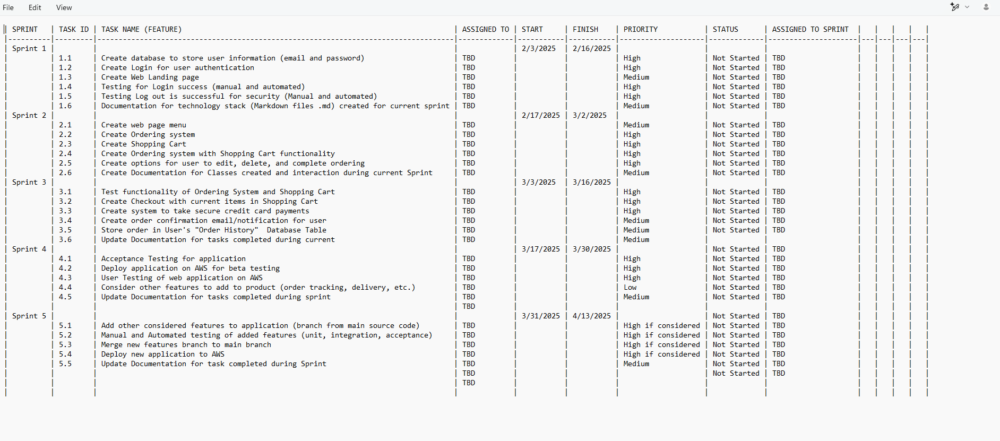

## Project Name: Pizza Ordering Web Application

## Team Number: 6

## Project Manager: Brian Gill
### Contribution to the Project Product Backlog

* For this project, we contributed to the Product Backlog (PB) by defining the project's core features and functionalities.  We collaboratively discussed and agreed upon the scope, focusing on essential elements like online ordering, menu display, shopping cart functionality, and secure payment processing. I participated in discussions about the tools and technologies we would use for the project  such as the use of Bootstrap for front-end development, Django for the backend, and the selection of appropriate IDEs. We also discussed and agreed upon effective collaboration methods, such as using GitHub for project tracking and communication. We also talk about the importance of security, data encryption, and the use of sandboxes for payment processing. Our collaborative discussions on these topics shaped the PB and ensured that it reflected a shared understanding of the project's objectives and limitations.  

**Screenshot of Group_6_Product_Backlog.md:**

