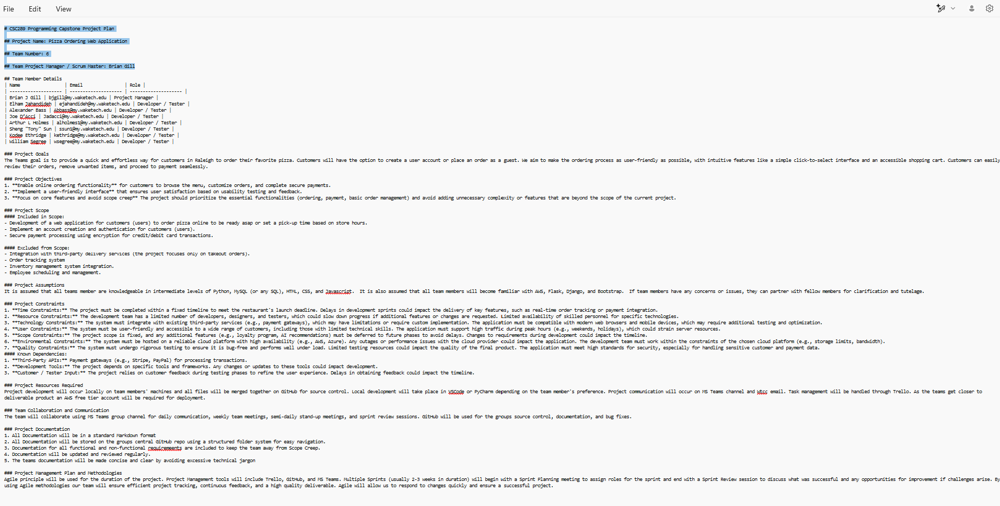
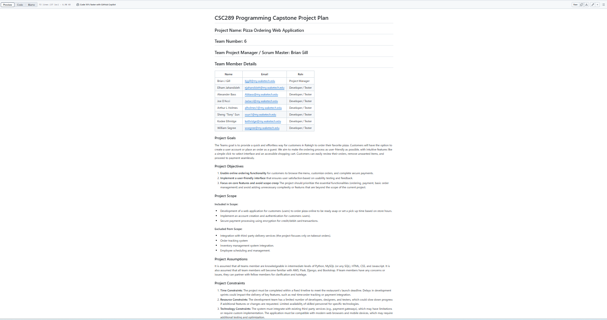

## Project Name: Pizza Ordering Web Application

## Team Number: 6

## Project Manager: Brian Gill

### Contribution to the Project Development Plan (PDP)
I am a member of Group 6, working on the pizza Ordering Web Application, led by Project Manager Brian Gill. I contributed to the Project Development Plan (PDP) by focusing on defining the project objectives and scope. As a team, we collaboratively outlined the project's goals, high-level purpose, and measurable objectives while ensuring a clear understanding of included and excluded functionalities. Additionally, we documented key assumptions, constraints, and required resources to facilitate effective project management. My specific role was  refine and represent the project objectives and scope, ensuring alignment with our team's vision and goals.

**Screenshot of PDP.md:**

